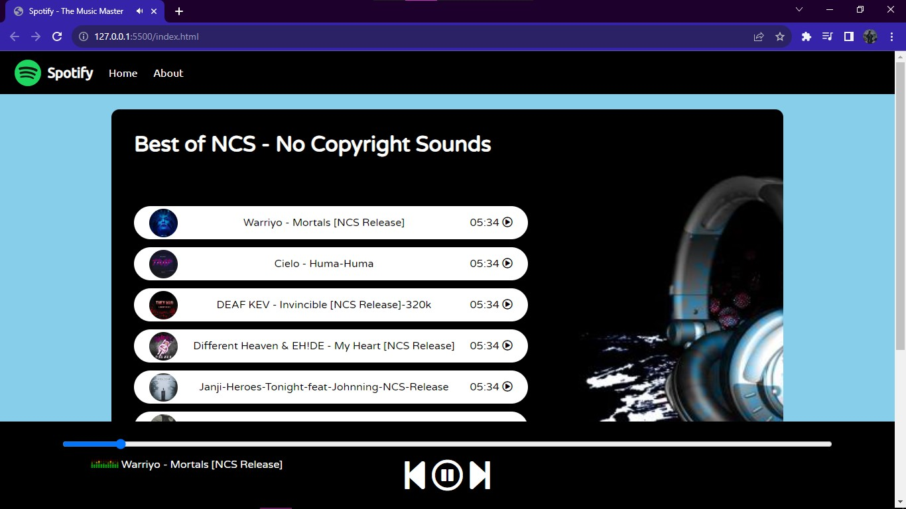

# The Music Master - A Spotify Clone



## Introduction

The Music Master is a lightweight Spotify clone created using pure HTML, CSS, and JS. It replicates the core features of the popular music streaming platform, allowing users to browse and play their favorite tracks. The project also integrates Font Awesome icons for intuitive playback controls.

## Features

- Seamless user interface for browsing and playing music.
- Utilizes Font Awesome icons for play, pause, next, and previous buttons.
- Responsive design for optimal viewing on various devices.
- Easily customizable and extendable codebase.
- Supports pause functionality from the music item list.

## Usage

To use The Music Master, follow these steps:

1. Clone the repository to your local machine:

```bash
git clone https://github.com/tayyab-004/spotify-clone.git
```

2. Open `index.html` in your preferred web browser.

3. Start exploring and playing your favorite music!

## Collaboration

We welcome collaboration to enhance and refine The Music Master. Here are some areas where you can contribute:

1. **Responsiveness**: Help make the website responsive across different devices and screen sizes.

2. **Pause Functionality**: Implement the ability to pause music directly from the music item list.

## How to Contribute

1. Fork the repository.
2. Create a new branch for your feature: `git checkout -b feature-name`.
3. Commit your changes: `git commit -m 'Add new feature'`.
4. Push to your branch: `git push origin feature-name`.
5. Create a pull request.

## License

This project is licensed under the MIT License - see the [LICENSE](LICENSE) file for details.

## Acknowledgements

- Font Awesome for providing the icons used in this project.
- Spotify for inspiration and providing a platform for music enthusiasts.

---

Enjoy your music with The Music Master! If you have any questions or suggestions, feel free to open an issue or reach out to us.

Happy listening! 🎵